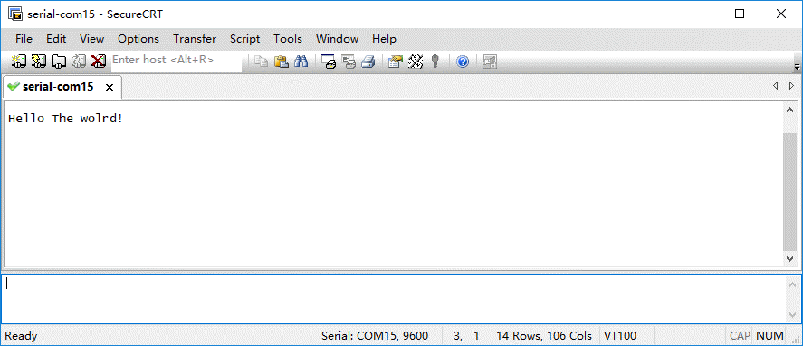
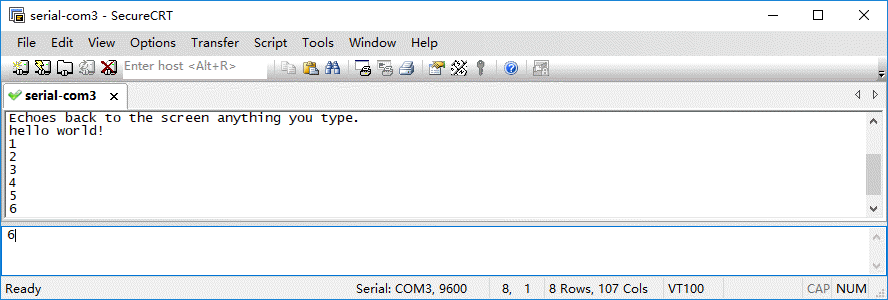

# 实验-2 Modular-2与电脑的USB通信
## 实验目的
了解Modular-2的USB接口，实验使用Modular-2通过烧录程序的USB电缆与电脑主机通信。
## 实验设备
### 硬件：
+ modular-2一台（V1.3）
+ PC电脑一台
### 软件：
+ WINDOWS 7操作系统
+ [SecureCRT终端仿真程序](https://www.vandyke.com/download/securecrt/download.html)
## 实验原理
Modular-2通过烧录程序的USB电缆虚拟USB串口与电脑主机通信。
## 实验内容
实验为二个实用小程序，代码列出，其他操作下文省略。
### 打印输出信息给电脑主机终端(经常用于调试)
直接使用实验1代码
```
#include "mbed.h"
DigitalOut myled(PC_6);
int main() {
    printf("Hello The wolrd!\n");//打印输出一些信息给电脑主机终端
    while(1) {
        myled = !myled; 
        wait(1.0); // 1 sec
    }
}
```
#### 复位运行
modular-2复位后，开始运行程序，程序为绿灯每秒闪烁一次。
#### 串口监控
PC电脑通过数据线连接Modular-2，并运行SecureCRT设置为串口模式，选择Modular-2在系统中生成的串口，打开互动窗口后，进行SecureCRT会话设置。
#### 打印输出信息

### 电脑主机输入数据给modular-2，并输出返回
```
#include "mbed.h"              
 Serial pc(USBTX, USBRX);
 int main() {
    pc.printf("Echoes back to the screen anything you type.\n");
    while(1) {
        pc.putc(pc.getc());
    }
}
```

### 延伸内容
做为一个串口与一些电脑主机软件通信，例如：perl，python，node.js，LabVIEW。
### 其他事项
更多源码范例可以查看[项目汇总表](https://github.com/modular2/modular-2/blob/master/software/readme.md)
