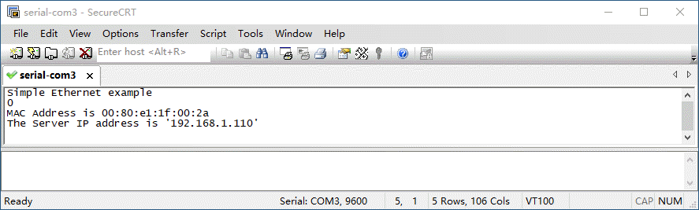
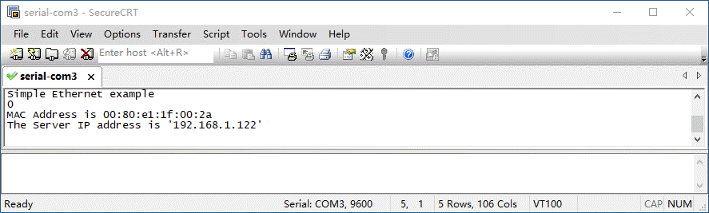
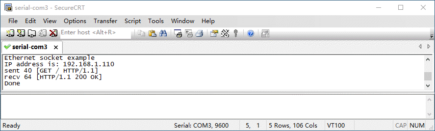

# 实验-3 Modular-2以太网设置与Socket通信
## 实验目的
了解Modular-2的以太网接口，实验使用Modular-2以太网接口库的调用及Socket通信。
## 实验设备
### 硬件：
+ modular-2一台（V1.3）
+ PC电脑一台
### 软件：
+ WINDOWS 7操作系统
+ [SecureCRT终端仿真程序](https://www.vandyke.com/download/securecrt/download.html)
## 实验原理
Modular-2以太网接口提供了一个通过以太网连接到Internet的C++ API。默认情况下，此类不需要任何配置。它能够为目标获取默认以太网驱动程序并选择正确的网络堆栈。
## 实验内容
实验为三个实用小程序，代码列出，其他操作下文省略。
### 设置以太网DHCP网络连接
```
#include "mbed.h"
#include "EthernetInterface.h"
int main() {
    printf("Simple Ethernet example\n");//打印输出一些信息给电脑主机终端
    EthernetInterface eth;
    printf("%d \n",eth.connect());//打印连接状态 0为成功
    printf("MAC Address is %s \n",eth.get_mac_address());//输出MAC地址
    printf("The Server IP address is '%s'\n", eth.get_ip_address());//输出IP地址
}
```
#### 连接以太网
modular-2网线连接交换机或者路由器，设备复位后，开始运行程序
#### 串口监控
PC电脑通过数据线连接Modular-2，并运行SecureCRT设置为串口模式，选择Modular-2在系统中生成的串口，打开互动窗口后，进行SecureCRT会话设置。
#### 打印输出信息

### 设置以太网静态网络连接
```
#include "mbed.h"
#include "EthernetInterface.h"
int main() {
    printf("Simple Ethernet example\n");//打印输出一些信息给电脑主机终端
    EthernetInterface eth;
    eth.set_network("192.168.1.122","255.255.255.0","192.168.1.1"); //设置静态IP地址
    printf("%d \n",eth.connect());//打印连接状态 0为成功
    printf("MAC Address is %s \n",eth.get_mac_address());//输出MAC地址
    printf("The Server IP address is '%s'\n", eth.get_ip_address());//输出IP地址
}
```

### 使用Socket的HTTP请求
```
#include "mbed.h"
#include "EthernetInterface.h"
EthernetInterface eth;
int main() {
    printf("Ethernet socket example\n");
    eth.connect();
    const char *ip = eth.get_ip_address();
    printf("IP address is: %s\n", ip ? ip : "No IP");//输出IP地址

    TCPSocket socket;
    socket.open(&eth);//在网络接口上打开一个Socket。
    socket.connect("www.baidu.com", 80);//连接百度网站80端口

    // 发送一个简单的http请求
    char sbuffer[] = "GET / HTTP/1.1\r\nHost: www.baidu.com\r\n\r\n";
    int scount = socket.send(sbuffer, sizeof sbuffer);
    printf("sent %d [%.*s]\n", scount, strstr(sbuffer, "\r\n")-sbuffer, sbuffer);

    // 接收http响应并打印输出
    char rbuffer[64];
    int rcount = socket.recv(rbuffer, sizeof rbuffer);
    printf("recv %d [%.*s]\n", rcount, strstr(rbuffer, "\r\n")-rbuffer, rbuffer);
   
    socket.close(); // 关闭Scoket,释放资源 
    eth.disconnect();// 关闭网络接口
    printf("Done\n");
}
```

### 扩展内容
利用以太网接口及Socket访问更多的网站，处理网站响应，显示更多回应内容。

### 其他事项
更多源码范例可以查看[项目汇总表](https://github.com/modular2/modular-2/blob/master/software/readme.md)
