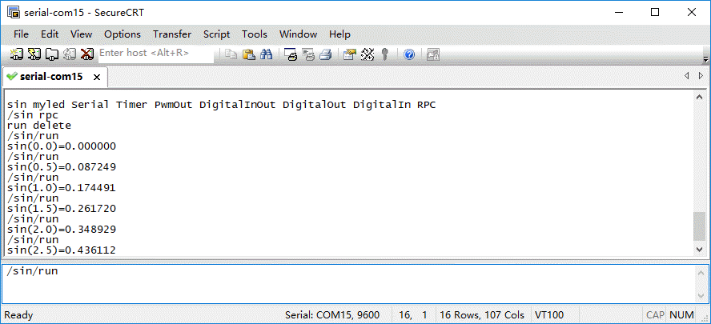

# 实验-10 Mbed串口RPCFunction的使用
## 实验目的
了解远程过程调用(RPC)的实现机制，实验使用modular-2通过串口进行RPCFunction的使用。
## 实验设备
### 硬件：
+ Modular-2一台（V1.3）
+ PC电脑一台
### 软件：
+ WINDOWS 7操作系统
+ SecureCRT 7终端仿真程序
## 实验原理
### 什么是RPC？
Remote Procedure Call (RPC)远程过程调用允许计算机程序在另一台计算机上执行子程序。它通常用于计算设备的网络中。在Mbed系统中，您可以通过在终端或浏览器上简单地调用主机上的变量或函数的名称来操纵变量并在Mbed上执行子程序。

RPC范例允许用其他语言编写的程序与Mbed通信。例如，可以使用Python、Java、Matlab等语言中的库，这使得基于GUI的命令在Mbed上执行。

### 如何快速实现RPC接口
Modular2的Mbed RPC接口，可使用电脑通过终端程序USB串口连接。<br>
终端设置为：CR+LF, 9600, 8数据位，无奇偶位，1停止位，本地回显。

Modular2 的Mbed RPC还能够通过RPC接口库与主流编程言进行连接。这些库允许其他程序通过RPC直接通信到Mbed，而不需要传输设置或格式化RPC命令。相关库可用于Matlab、LabVIEW、Python、Java和.NET。

### RPC接口库（mbed-rpc）
使用mbed-rpc的接口遵循以下命令格式：```RPC::call(buf, outbuf);```

外部调用命令如下：

|命令|返回结果|
| :------:| :------:|
|Enter	|返回所有可用的RPC对象名|
|"/<对象名> RPC"|	返回该对象下可用的RPC方法|
|"<对象名>/<方法名> <参数(多参数空格隔开)>"	|使用输入的参数执行该对象的方法|

注意!<br>
如果你要使用你自定义的对象，请确保mbed已经定义该对象。<br>
方法没有参数时，需要加空格做为空参数。<br>
"RPCobject/read " 执行，"RPCobject/read" 不执行。<br>
### RPC接口库主要类
* RPCFunction – 通过RPC调用mbed 自定义函数的类；
* RPCVariable – 使用RPC读写mbed自定义变量的类；
* SerialRPCInterface – 使用RPC调用串口的类。
## 实验内容
使用实验8源码进行部分修改，构造一个RPC函数，调用返回一个SIN函数值。
### 代码
```
#include "mbed.h"
#include "mbed_rpc.h"
#include "SerialRPCInterface.h" //加入SerialRPCInterface类，Mbed RPCInterface类
using namespace mbed;
double angle=0;//初始化角度值
RpcDigitalOut myled(PC_6,"myled");// RpcDigitalOut实例化PC_6引脚，更多请查阅RpcClasses.h
SerialRPCInterface rpc(USBTX, USBRX); //RPC串口调用申明
void sinewave(Arguments *in, Reply *out);//调用函数内部申明
RPCFunction rpc_sinewave(&sinewave, "sinewave");//调用函数外部申明
void sinewave(Arguments *in, Reply *out) {
    char buffer[16];    
    double  value=10*sin(3.141 *  angle/180);
    sprintf(buffer,"sin(%.1f)=%f",angle,value);
    angle=angle+0.5;//角度步长0.5
    if (angle>=360) angle=0;  
    out->putData(buffer);   
}
int main() {
    char buf[256], outbuf[256];
    while(1) {
         RPC::call(buf, outbuf); 
     }
}
```
### 串口终端SecureCRT设置
PC电脑通过数据线连接Modular-2，并运行SecureCRT设置为串口模式，选择Modular-2在系统中生成的串口，打开互动窗口后，进行SecureCRT会话设置。
### RPC串口命令调用
使用串口终端不断发送RPC命令/sin/run ，返回得到当前的sin函数值。<br>
```
/sin rpc
run delete
/sin/run 
sin(0.0)=0.000000
/sin/run 
sin(0.5)=0.087249
/sin/run 
sin(1.0)=0.174491
/sin/run 
sin(1.5)=0.261720
/sin/run 
sin(2.0)=0.348929
/sin/run 
sin(2.5)=0.436112
 ```

### 其他事项
更多源码范例可以查看[项目汇总表](https://github.com/modular2/modular-2/blob/master/software/readme.md)
