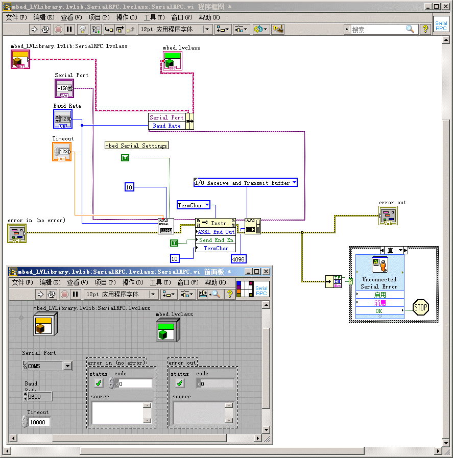
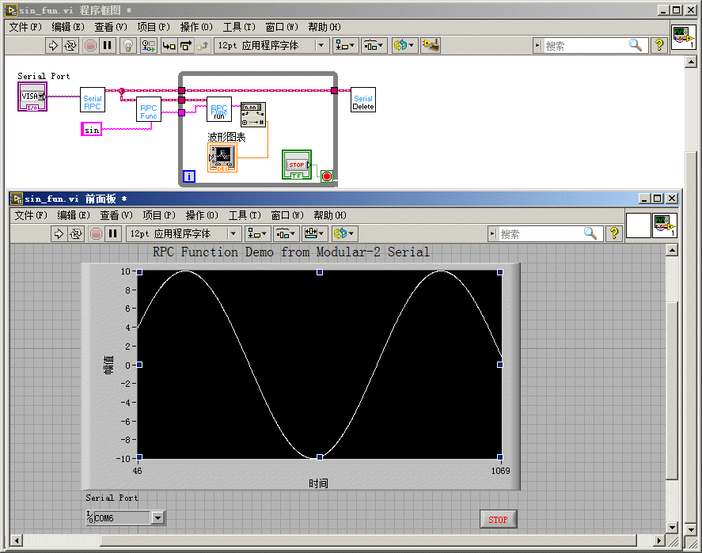

# 实验-13 利用LabView的Mbed RPC库实现串口RPC Function调用
## 实验目的
了解远程过程调用(RPC)的实现机制，实验利用LabView的Mbed RPC库实现串口RPC Function调用。
## 实验设备
### 硬件：
+ Modular-2一台（V1.3）
+ PC电脑一台
### 软件：
+ WINDOWS 7操作系统
+ SecureCRT 7终端仿真程序
+ NI LabVIEW（使用labview 9以后得版本，导入针对MBed API编写的VI库文件）
## 实验原理
### 什么是RPC？
Remote Procedure Call (RPC)远程过程调用允许计算机程序在另一台计算机上执行子程序。它通常用于计算设备的网络中。在Mbed系统中，您可以通过在终端或浏览器上简单地调用主机上的变量或函数的名称来操纵变量并在Mbed上执行子程序。

RPC范例允许用其他语言编写的程序与Mbed通信。例如，可以使用Python、Java、Matlab等语言中的库，这使得基于GUI的命令在Mbed上执行。

### 如何快速实现RPC接口
Modular2的Mbed RPC接口，可使用电脑通过终端程序USB串口连接。<br>
终端设置为：CR+LF, 9600, 8数据位，无奇偶位，1停止位，本地回显。

Modular2 的Mbed RPC还能够通过RPC接口库与主流编程言进行连接。这些库允许其他程序通过RPC直接通信到Mbed，而不需要传输设置或格式化RPC命令。相关库可用于Matlab、LabVIEW、Python、Java和.NET。

### RPC接口库（mbed-rpc）
使用mbed-rpc的接口遵循以下命令格式：```RPC::call(buf, outbuf);```

外部调用命令如下：

|命令|返回结果|
| :------:| :------:|
|Enter	|返回所有可用的RPC对象名|
|"/<对象名> RPC"|	返回该对象下可用的RPC方法|
|"<对象名>/<方法名> <参数(多参数空格隔开)>"	|使用输入的参数执行该对象的方法|

注意!<br>
如果你要使用你自定义的对象，请确保mbed已经定义该对象。<br>
方法没有参数时，需要加空格做为空参数。<br>
"RPCobject/read " 执行，"RPCobject/read" 不执行。<br>
### RPC接口库主要类
* RPCFunction – 通过RPC调用mbed 自定义函数的类；
* RPCVariable – 使用RPC读写mbed自定义变量的类；
* SerialRPCInterface – 使用RPC调用串口的类。
### TCPSocket类
提供通过TCP发送数据流的能力。TCPSocket维护一个以connect成员函数开始的有状态连接。成功连接到服务器后，您可以使用send和recv成员函数来发送和接收数据。
构造函数接受ethernet stack指针以打开指定EthernetInterface上的套接字。如果你没有传入构造函数，那么你必须调用open来初始化套接字。
有关TCP服务器功能，请参阅TCPServer类。
### LabVIEW和Mbed的接口
Mbed提供一些LabVIEW RPC库用于将Mbed与LabVIEW进行连接，允许LabVIEW程序与真实世界交互。<br>
这些库可以用于：
+ LabVIEW通过Med连接的传感器进行数据采集
+ 从LabVIEW控制连接到Mbed的执行部件
+ LabVIEW程序可以硬件控制反馈，计算和控制均在LabVIEW中实现

LabVIEW RPC使您可以直接使用RPC控制Mbed。对于许多应用程序，不必为Mbed编写任何自定义代码。<br>
LabVIEW串口通讯库也可以使用串口直接控制Mbed。
### LabVIEW安装准备
LabVIEW使用Mbed，需要安装Ni-VISA驱动程序来访问USB串行端口。<br>
[http://www.ni.com/trylabview/](http://www.ni.com/trylabview/) LabView试用版<br>
 NI-VISA串口驱动程序<br>
### Mbed LabVIEW库中的Serial RPC类

## 实验内容
以实验10为基础，运行LabView，通过串口调用RPC Function在LabVIEW中显示Sin函数曲线。<br>
### 代码
```
#include "mbed.h"
#include "mbed_rpc.h"
#include "SerialRPCInterface.h" //加入SerialRPCInterface类，Mbed RPCInterface类
using namespace mbed;
double angle=0;//初始化角度值
RpcDigitalOut myled(PC_6,"myled");// RpcDigitalOut实例化PC_6引脚，更多请查阅RpcClasses.h
SerialRPCInterface rpc(USBTX, USBRX); //RPC串口调用申明
void sinewave(Arguments *in, Reply *out);//调用函数内部申明
RPCFunction rpc_sinewave(&sinewave, "sinewave");//调用函数外部申明
void sinewave(Arguments *in, Reply *out) {
    char buffer[16];    
    double  value=10*sin(3.141 *  angle/180);
    sprintf(buffer,"%f",value);
    angle=angle+0.5;//角度步长0.5
    if (angle>=360) angle=0;  
    out->putData(buffer);   
}
int main() {
    char buf[256], outbuf[256];
    while(1) {
         RPC::call(buf, outbuf); 
     }
}
```
### LabVIEW中使用波形图表显示Sin函数曲线
在LabVIEW的前面板中，修改Serial Port为Modular-2在系统中生成的串口，点击运行可在波形图表中显示Sin函数曲线。

### 其他事项
更多源码范例可以查看[项目汇总表](https://github.com/modular2/modular-2/blob/master/software/readme.md)
