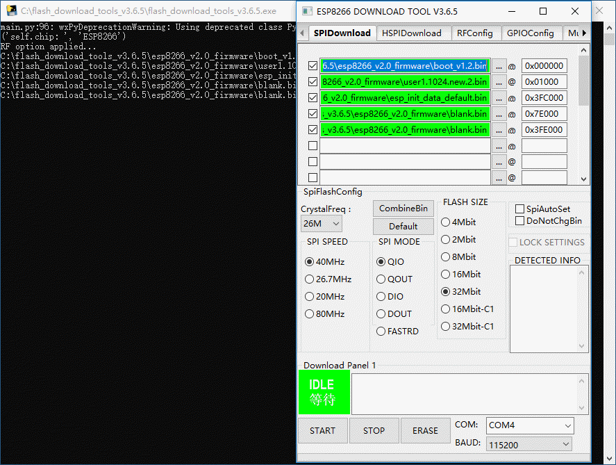
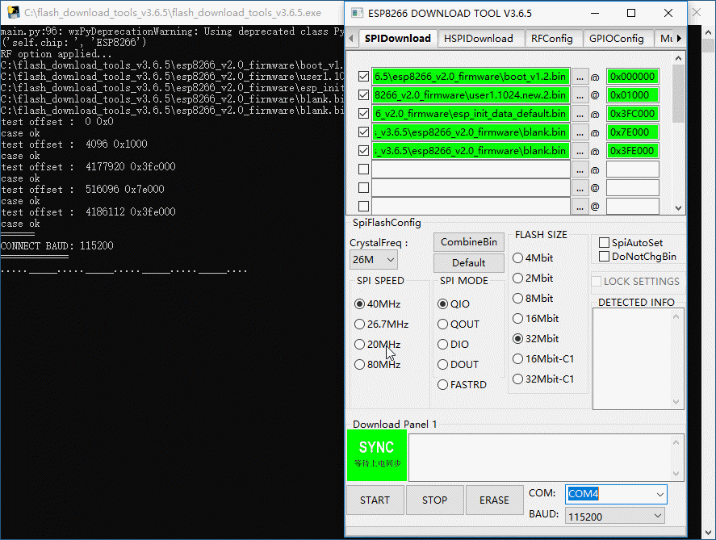
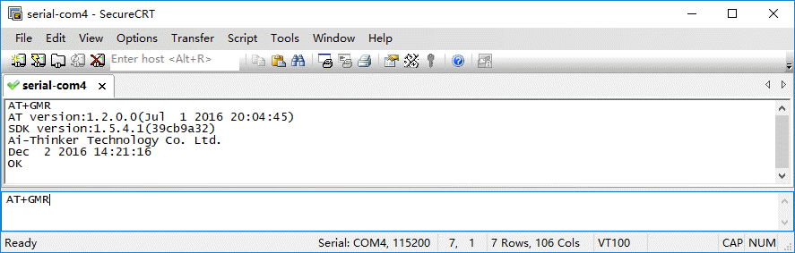
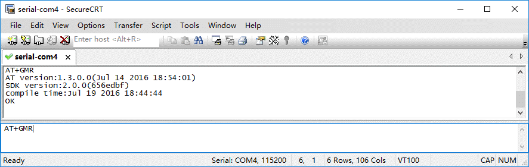

# 实验-14 ESP-12F WIFI模块的升级
## 实验目的
了解WIFI模块UART实现机制，实验使用modular-2通过串口进行ESP-12F WIFI模块的升级。
## 实验设备
### 硬件：
+ Modular-2一台（V1.3）
+ ESP-12F WIFI模块
+ PC电脑一台
### 软件：
+ WINDOWS 7操作系统
+ SecureCRT 7终端仿真程序
+ [flash download tools ESP系列模组固件升级工具（v3.6.5）](https://www.espressif.com/sites/default/files/tools/flash_download_tools_v3.6.5_0.zip)
+ [esp8266固件（v2.0）](https://os.mbed.com/media/uploads/sarahmarshy/esp8266_v2.0_firmware.zip) 
## 实验原理
使用编译导入USB串口透明传输代码的modular-2与WIFI模块数据交换，利用固件升级工具，直接升级WIFI模块固件。
## 实验内容
### USB串口透明传输
编译代码导入modular-2实现USB串口直接将AT命令透明传输至WIFI模块，代码详见实验内容。
### 设置WIFI模块进入升级模式
将WIFI模块的DIP开关2设置为ON。
### 运行flash download tools导入升级固件
#### 设置BIN地址
|Bin|Address|
| :----: | :----: |
|boot_v1.2.bin|0x000000|
|user1.1024.new.2.bin|0x01000|
|esp_init_data_default.bin|0x3FC000|
|blank.bin|0x7E000|
|blank.bin|0x3FE000|
#### 配置相关参数，如下图所示

SPI速率为40MHz，SPI模式为QIO，FLASH大小为32M，最后选择modular-2的USB串口，设置速率为115200。
#### 点击开始，按modular-2复位键后，进行固件升级

### 代码
```
#include "mbed.h"
RawSerial  pc(USBTX, USBRX);
RawSerial  dev(PB_6, PB_7);
DigitalOut led1(PC_6);
DigitalOut led4(PC_7);
DigitalOut WifiEnable(PD_13);
DigitalOut WifiRST(PD_12);
void dev_recv()
{
    led1 = !led1;
    while(dev.readable()) {
        pc.putc(dev.getc());
    }
}
void pc_recv()
{
    led4 = !led4;
    while(pc.readable()) {
        dev.putc(pc.getc());
    }
}
int main()
{
    WifiEnable=1;
    WifiRST=0;
    wait(0.1);
    WifiRST=1; 
    pc.baud(115200);
    dev.baud(115200);
    pc.attach(&pc_recv, Serial::RxIrq);
    dev.attach(&dev_recv, Serial::RxIrq);
    while(1) {
        sleep();
    }
}
```
### 串口终端SecureCRT设置
PC电脑通过数据线连接Modular-2，并运行SecureCRT设置为串口模式，选择Modular-2在系统中生成的串口，打开互动窗口后，进行SecureCRT会话设置。
### 串口AT命令查询
固件升级前后可以使用串口终端发送AT+GMR查询固件版本<br>


### 其他事项
更多源码范例可以查看[项目汇总表](https://github.com/modular2/modular-2/blob/master/software/readme.md)
