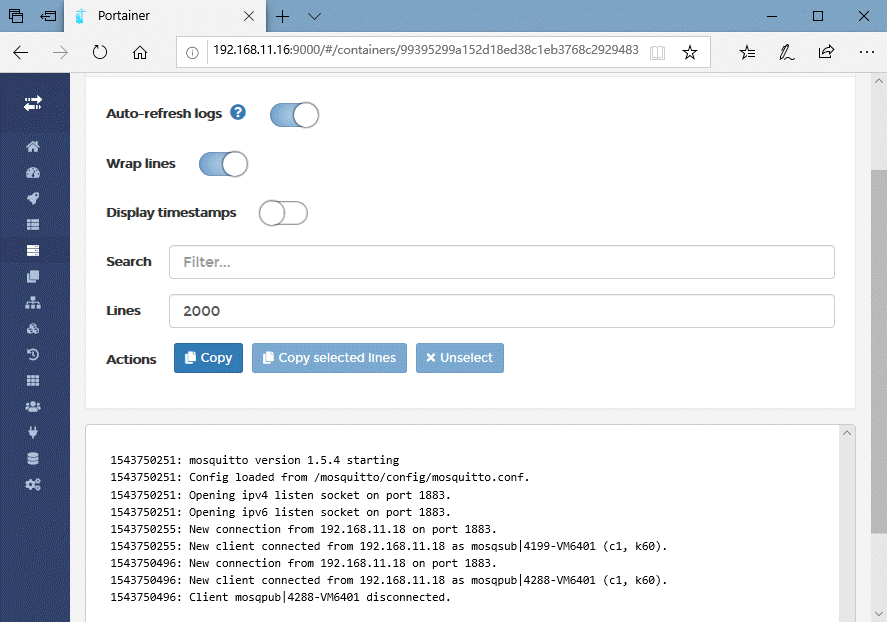

# 使用Docker快速部署TICK+Mosquitto实现MQTT数据输入图形化监视
## TICK Stack简介
TICK Stack是来自时间序列数据库InfluxDB公司开发的四款监控开源产品集合。它由以下组件组成：
+ **T**=Telegraf从各种来源收集时间序列数据。
+ **I**=InfluxDB是开源的分布式时序、时间和指标数据库。
+ **C**=Chronograf可视化和图形化时间序列数据。
+ **K**=Kapacitor提供警报并检测时间序列数据中的异常，并提供数据分析与机器学习接口。


更多内容请访问[https://www.influxdata.com/time-series-platform/](https://www.influxdata.com/time-series-platform/)
## 准备工作
安装Docker与Portainer容器管理工具，参考[LINUX安装Docker及Portainer可视化界面](./install_docker_and_portainer_on_linux.md)
## 安装Mosquitto镜像
```
$ sudo docker search mosquitto
NAME                         DESCRIPTION                                     STARS     OFFICIAL     AUTOMATED
eclipse-mosquitto            Eclipse Mosquitto is an open source message …   205        [OK]                
toke/mosquitto               mosquitto mqtt broker based on Debian Jessie…   61                        [OK]
ansi/mosquitto               MQTT Mosquitto 1.5 build on ubuntu 18.4         36                        [OK]
fstehle/rpi-mosquitto        Raspberry Pi compatible Docker Image with mo…   17                        [OK]
jllopis/mosquitto            Mosquitto MQTT Broker With auth plugin on Al…   13                        [OK]
......
```
默认安装方式
```
$ sudo docker run -d --name m2_mqtt -p 1883:1883 -p 9001:9001 eclipse-mosquitto
1543744425: mosquitto version 1.5.4 starting
1543744425: Config loaded from /mosquitto/config/mosquitto.conf.
1543744425: Opening ipv4 listen socket on port 1883.
1543744425: Opening ipv6 listen socket on port 1883.
```
可以安装mosquitto客户端进行测试，并通过Portainer查看容器情况


更多配置请参考[https://hub.docker.com/_/eclipse-mosquitto/](https://hub.docker.com/_/eclipse-mosquitto/)
## 快速部署TICK
### 安装InfluxDB镜像
```
$ sudo docker run -d --name m2influx -p 8888:8888 -p 8086:8086 influxdb // 8888提供给Chronograf使用
```
更多配置请参考[https://hub.docker.com/_/influxdb/](https://hub.docker.com/_/influxdb/)
### 安装Telegraf镜像
#### 针对MQTT输入自定义配置文件
1. 获取telegraf配置文件模板另存为telegraf.conf
    ```
    $ sudo docker run --rm telegraf telegraf config > telegraf.conf
    ```
2. 取消telegraf.conf中以下相关区域的注释
    ```
    [[outputs.influxdb]]
    urls = ["http://127.0.0.1:8086"]
    database = "telegraf"
    retention_policy = ""
    write_consistency = "any"
    timeout = "5s"
    insecure_skip_verify = false
    ......
    [[inputs.docker]] //输入docker监视数据
    endpoint = "unix:///var/run/docker.sock"
    gather_services = false
    container_names = []
    container_name_include = []
    container_name_exclude = []
    timeout = "5s"
    perdevice = true
    total = false
    tag_env = ["JAVA_HOME", "HEAP_SIZE"]
    docker_label_include = []
    docker_label_exclude = []
    ......
    [[inputs.mqtt_consumer]]
    servers = ["tcp://172.17.0.3:1883"] //与Mosquitto容器IP一致
    qos = 2
    connection_timeout = "30s"
    topics = ["sensors/iot_simulator"] //与Mosquitto发布主题一致
    persistent_session = false
    client_id = ""
    insecure_skip_verify = true
    data_format = "json"
    ```
#### 使用工作目录下的telegraf.conf配置文件创造并启动telegraf容器
```
$ sudo docker run -d --net=container:m2influx \
        --name m2_telegraf \
        -v /var/run/docker.sock:/var/run/docker.sock \
        -v $PWD/telegraf.conf:/etc/telegraf/telegraf.conf \
        telegraf
```

[inputs.mqtt_consumer]:connected 信息出现显示MQTT输入插件开始工作。

注意Hostname名称。更多配置请参考[https://hub.docker.com/_/telegraf/](https://hub.docker.com/_/telegraf/)
### 安装Chronograf镜像
```
$ sudo docker run -d --net=container:m2influx \
        --name m2_chronograf \
        -v chronograf:/var/lib/chronograf \
        chronograf
```

浏览器访问主机IP地址的8888端口

连接数据库

选择内置监视面板

暂时跳过不设置Kapacitor

配置向导完成

浏览主机


Docker监视面板

MQTT输入数据

MQTT数据源modular-2采集数据。更多配置请参考[https://hub.docker.com/_/chronograf/](https://hub.docker.com/_/chronograf/)
### 安装Kapacitor镜像
```
$ sudo docker run -d -p 9092:9092 \
      -v kapacitor:/var/lib/kapacitor \
      kapacitor
```
更多配置请参考[https://hub.docker.com/_/kapacitor/](https://hub.docker.com/_/kapacitor/)